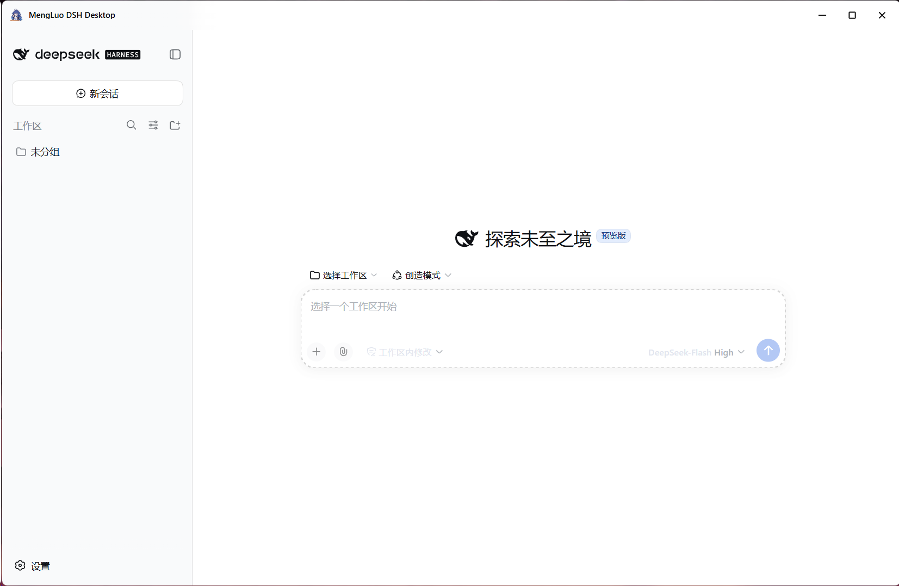
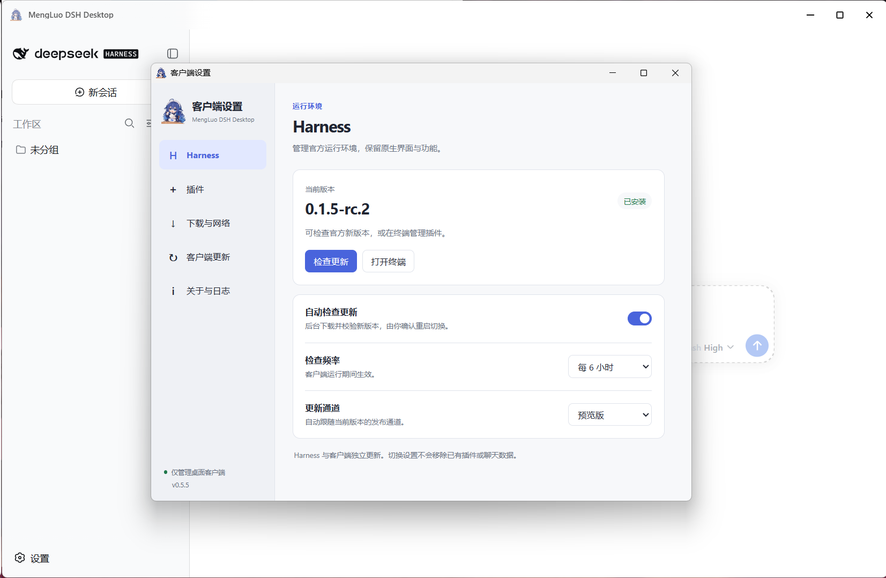
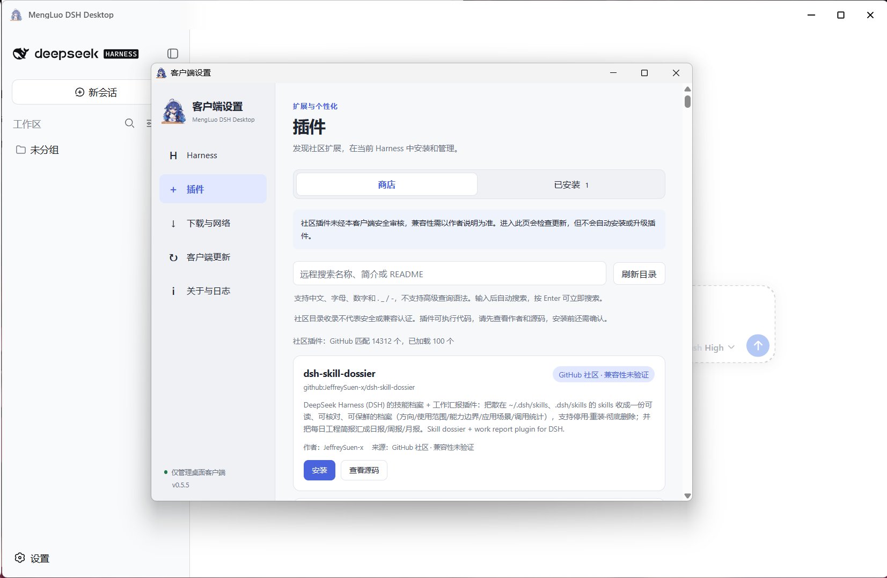

# MengLuo DSH Desktop

English | [中文](README.zh.md) | [Changelog](CHANGELOG.md)

An unofficial, personal-maintainer Windows desktop client for [DeepSeek Harness](https://github.com/deepseek-ai/deepseek-harness). This project is not affiliated with, sponsored by, or endorsed by DeepSeek. Harness provides the agent and its Web UI; this project provides installation, native windows, process supervision, and desktop integration.

For the latest public installer, see [GitHub Releases](https://github.com/Coyami-Mengluo/mengluo-dsh-desktop/releases/latest). See the [changelog](CHANGELOG.md) for changes and release history. Source changes may be newer than the latest installer.

## Install and use

Download the **setup.exe** from [GitHub Releases](https://github.com/Coyami-Mengluo/mengluo-dsh-desktop/releases/latest). The first launch asks you to choose an official Harness version and a download source: official npm (the default) or the third-party npmmirror service. Version information always comes from official npm. An existing verified installation is reused. The installer includes Electron, installation Node and npm, but not Harness itself. Windows x64 is the supported platform. Unsigned preview builds can trigger SmartScreen warnings.

Closing the main window hides it to the tray. Right-click the tray, or press **Ctrl+Alt+U**, for the menu; choose **Quit** to stop the client and Harness. The menu also opens a terminal with the selected Harness runtime's Node and `dsh`, plus pinned npm/npx/pnpm tooling. Git is available only if installed on Windows.

The short menu contains **Open Harness terminal**, **Client settings**, and **Quit**; the tray also provides **Show main window**. **View update progress** appears when progress is available. Closing the separate settings window hides it without stopping Harness.

The transparent application icon is AI-generated artwork supplied by the maintainer, not an official DeepSeek logo. Artwork provenance and its separate terms are in [the artwork notice](assets/ARTWORK.md). The original MIT geometric SVG is retained as an alternative.

## Screenshots

The desktop client, Harness settings, and community plugin store. See [screenshot provenance](docs/screenshots/README.md).

Harness in the desktop window:



Harness version and update settings:



Community plugin store:



## Client settings and download sources

The first-install page and client settings offer **Follow system / 简体中文 / English**. Changes apply immediately to client windows, menus and update progress and are saved in the client's `language-settings.json`. They do not restart Harness, translate its official UI or rewrite community plugin names and descriptions. Follow system uses Simplified Chinese for Chinese system locales and English otherwise.

Open **Client settings** from the tray or **Ctrl+Alt+U** menu. It has five sections:

- **Harness:** current version, installation and updates, update channel, automatic checking and its interval. Automatic Harness checks retain the existing behavior: a discovered update can be downloaded and verified in the background, then you are asked to restart before switching to it.
- **Plugins:** a community discovery list and management of user-added plugins in Harness's `web` profile, with read-only update checks and user-confirmed installation, updates and removal.
- **Downloads & network:** Harness download source, connection checks, and the detected system proxy status.
- **Client updates:** the desktop client version, manual checks, daily automatic checking, download progress and confirmed restart/install.
- **About & logs:** project links, version and license information, and the log shortcut.

The first-install page and network settings share one per-user `download-settings.json` file in the application's profile. Source changes apply to future managed Harness installations and updates, not an in-progress task. They do not change global npm settings, the Harness terminal's npm configuration, Git plugin downloads, or the client's GitHub update feed.

Selecting npmmirror changes only the transport for npm package files. The client first obtains the exact version, dependency graph and SHA-512 integrity values from official npm, then downloads the locked package files through the mirror. A mirror connection failure or missing file can fall back to official npm for the same locked version and dependencies, within the existing timeout budget. Integrity failures are not bypassed; a failed candidate is not activated or silently replaced with an older version.

npmmirror is a third-party service and may lag behind official releases. It is not a guaranteed speedup: official metadata must still be reachable, and dependency resolution, disk verification and startup checks still take time. Connection checks also compare the target version's mirror metadata and integrity digest with official npm: the selected first-install version, or the prepared/available/current version in settings. A matching entry does not guarantee that all dependencies or tarballs are synchronized, and this is not a throughput benchmark. These settings do not alter the official Harness UI.

## Plugins

After installation, update or removal, **Restart Harness** reloads the current backend without closing client windows. Save your work before confirming: running tasks will be interrupted. It does not install a downloaded client update.

Cooldown messages identify local protection, GitHub search quota, plugin metadata quota, or temporary service throttling. Plugin update-check limits do not lock catalog refresh. A GitHub primary reset deadline is used only when that request bucket is exhausted; temporary limits use `Retry-After` or bounded backoff, not an unrelated hourly reset.

**Client settings → Plugins** has a store, an installed-plugin view and local snapshots. The store searches public, non-archived, non-fork repositories carrying GitHub's [`dsh-plugin` topic](https://github.com/topics/dsh-plugin), ordered by recent updates. Keywords are sent to GitHub's repository search across names, descriptions and READMEs, rather than filtering only the currently loaded list. Results load in pages of up to 100; use **Load more** for subsequent pages. GitHub exposes at most 1,000 results per search and may return incomplete results, so narrow the keywords when prompted. Repositories without this topic are outside the store's search scope.

Search input is debounced and recent query pages are cached to reduce anonymous API requests. Changing a query cancels or ignores stale responses so they cannot overwrite the newer results. A topic, listing or declared bundle is **not a security or compatibility certification**. Review the author, source, permissions, dependencies and license before installing; third-party plugins can execute code. Root packages that cannot be confirmed as installable Harness bundles require the author's manual installation instructions instead.

Search, pagination and refresh share a main-process budget of 8 search dispatches per rolling 60 seconds, with at least 1 second between dispatches. Cancelling a dispatched request does not refund it. Manual directory refresh and plugin update checks each have a 30-second cooldown. Other GitHub plugin metadata has a separate local budget of 50 requests per hour. Rate-limit responses and exhausted server budgets pause requests until the reported recovery time; rate limits without a valid recovery time use at least 60 seconds of backoff. The UI shows a countdown and requires a user retry when it expires, without an automatic retry loop. Recent cached queries and the last successful results remain available, with previous results labelled by their original query. These local budgets apply to the current client process; other programs sharing a proxy exit IP can still consume the server's allowance, so throttling cannot be ruled out entirely.

Entering the plugin page or choosing to check updates reads public metadata only. Plugins are never automatically updated in the background. An installation, update or removal requires an explicit button click and confirmation, then uses the selected runtime's official Harness plugin CLI. npm updates target an exact package version; store installations and GitHub updates target an exact commit. Official built-in components are not managed by these controls. The client prevents plugin changes from overlapping its Harness update tasks; do not change the same profile simultaneously in an external terminal or the official UI.

The installed view manages user-added plugins in the `web` profile. A GitHub plugin installed through this store records the selected branch and exact commit for future checks. Existing GitHub installs with no reliable installed commit or tracking ref, local packages and other unsupported sources show an unknown update state rather than guessing a target. Compatibility remains unknown unless a declaration is available; an author's declared version range is not a runtime compatibility test.

Plugin tasks use the system proxy, show stage/activity information and bounded recent output, and have a 30-minute timeout. They do not invent a download percentage when the official CLI provides no reliable total. The Harness mirror selector applies only to managed Harness runtime downloads: it does not change a plugin's registry, global npm configuration or GitHub source.

The client keeps minimal plugin-source bookkeeping (`plugin-sources.json`: package/spec, repository, tracking ref and commit) in its application profile, not in the official plugin configuration. It contains no credentials. Checking the store or updates sends search keywords and relevant public repository or npm package names to GitHub's API or official npm through the system proxy, without account credentials; it does not upload conversations or plugin configuration. Do not enter secrets in the store's search box. See [the plugin security boundary](SECURITY.md#plugin-boundary).

### Local plugin snapshots and rollback

Before a confirmed plugin installation, update or removal, the client copies and verifies the entire Harness `web` profile and its own `plugin-sources.json`. This includes the profile's dependency manifests, lockfiles, configuration and actual installed package files. If the snapshot cannot be created, the plugin command does not start. Snapshots stay in the local client profile and are not uploaded or included in source exports.

In **Plugins → Local snapshots**, choose a snapshot and confirm rollback. This restores the **whole saved `web` environment**, including other plugins in that profile. The client temporarily stops Harness, so finish active tasks first. Restoration uses the saved files offline, without downloading packages or running installation scripts, and restarts Harness after a successful restore. It requires the same Harness version, a verified snapshot and a current profile/source record matching the recorded state after that operation. Later changes can make an older snapshot unavailable; the client will not silently overwrite them.

Snapshots do not restore Harness runtime files, conversations, workspaces, other profiles or changes a plugin made outside the saved profile. Internal package-directory links are supported; external links and unsafe paths are refused. Normal retention targets the latest five completed snapshots. Incomplete or unverifiable copies and separate recovery copies may remain, so disk usage can exceed five snapshots. An interrupted rollback pauses further plugin changes and Harness startup until its retained transaction can be verified and repaired from the local snapshot controls.

**Profile configuration can contain secrets. These backups are local and unencrypted.** Protect them like the live profile and keep snapshots, recovery copies and configuration out of issues, screenshots and public archives. See [snapshot security and recovery limits](SECURITY.md#local-plugin-snapshots).

## Two separate update paths

- **Client updates:** check this repository's stable GitHub Releases automatically once a day, or manually from **Client settings → Client updates**. Download and restart both require confirmation. The installed NSIS client prefers differential downloads and falls back to a full installer if the required cache, old blockmap, or HTTP range support is unavailable. The progress window shows measured transferred bytes, speed, percentage and an estimate when available. Ordinary application exit never installs a pending update automatically. Portable/development builds link to the release page instead of replacing themselves.
- **Harness updates:** install one exact official npm version and its complete production dependencies into an isolated runtime slot, using the selected package-file download source, then verify and smoke-test it before a confirmed restart switches versions. Automatic checking can prepare this candidate in the background. This path does not use GitHub client updates and is not differential. npm preparation, mirror downloads and an official-source retry share the existing 30-minute timeout budget.

Client installers replace application files, not the per-user Harness runtime slots, plugins or conversations. A confirmed client restart stops current Harness tasks; finish them first. Existing private-client profiles and workspaces are reused when no new profile exists. Upstream Harness can change its own data formats; this project cannot guarantee compatibility with every future release or migrate undocumented formats.

## Build from source

Use **Windows x64 and Node.js 24.19.0**. No official Harness source checkout or pnpm workspace is needed.

```powershell
npm.cmd ci --ignore-scripts
npm.cmd run prepare:electron
npm.cmd run prepare:icon
npm.cmd test
npm.cmd start
```

To build the installer and portable client:

```powershell
npm.cmd run dist:win
npm.cmd run check:release
```

The build verifies a compatible local copy of the pinned Node/npm tools or downloads the fixed Node distribution from nodejs.org. The archive checksum, Node executable hash and Authenticode identity, and npm tree fingerprint are checked. Build downloads need internet access. Keep `package-lock.json` and use `npm ci`; do not copy another checkout's `node_modules`.

`dist/` contains the installer, its `.blockmap`, the portable executable and `latest.yml`. Local packaging **never uploads**. See [release instructions](docs/RELEASING.md) for the initial manual installation, publishing order, old-blockmap retention, and verification still needed before a public release.

## Security and contributions

See the concise [architecture overview](docs/ARCHITECTURE.md) for shell/runtime ownership, the two update paths, plugin recovery and trust boundaries.

See [SECURITY.md](SECURITY.md) for data locations, updater trust assumptions and reporting guidance, and [CONTRIBUTING.md](CONTRIBUTING.md) for development checks. Do not put API keys, logs, conversations, signing keys or personal configuration in an issue or source archive.

The official UI runs without a preload bridge, Node integration or injected UI patches. The shell samples only the top pixel strip for titlebar colors. Ordinary external links still open in the system browser.

## License

The shell and original placeholder SVG use [MIT](LICENSE). The illustrated PNG is excluded from that grant; see [the artwork notice](assets/ARTWORK.md). Third-party components retain their own licenses; see [THIRD_PARTY_NOTICES.md](THIRD_PARTY_NOTICES.md). DeepSeek's name and marks are not granted by this project's license.
